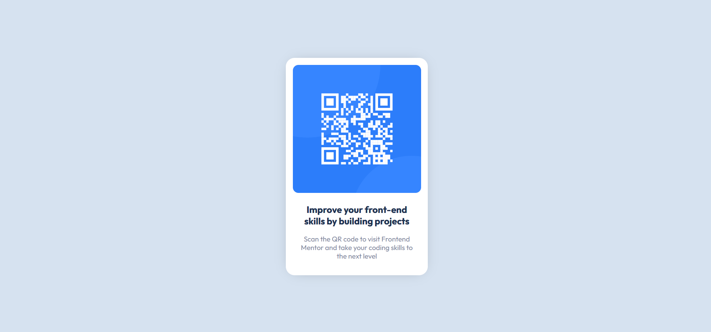
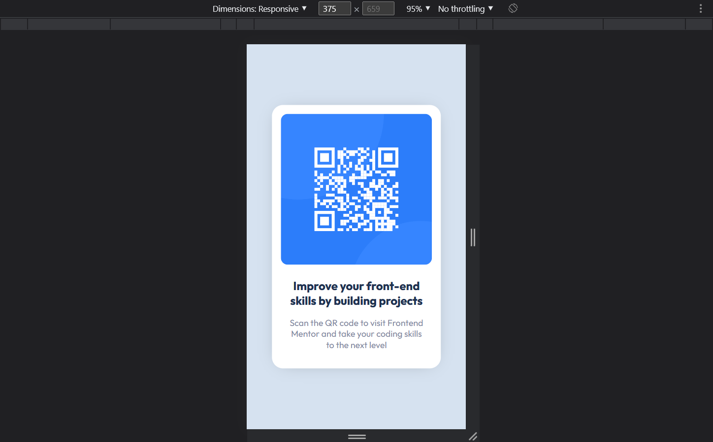

# Frontend Mentor - QR code component solution

This is a solution to the [QR code component challenge on Frontend Mentor](https://www.frontendmentor.io/challenges/qr-code-component-iux_sIO_H). Frontend Mentor challenges help you improve your coding skills by building realistic projects.

## Table of contents

- [Overview](#overview)
  - [Screenshot](#screenshot)
  - [Links](#links)
- [My process](#my-process)
  - [Built with](#built-with)
  - [Continued development](#continued-development)
- [Author](#author)

## Overview

### Screenshot

### Links

- Solution URL: [Github](https://github.com/Mtmuhammad/QR-code-component)
- Live Site URL: [Netlify](https://qr-componentmm.netlify.app/)

## My process

### Built with

- Semantic HTML5 markup
- Sass for CSS styling
- Mobile-first workflow
- [Bootstrap 5](https://getbootstrap.com/) - CSS framework

### Continued development

In the future, I am going to utilize Sass much more in my projects to gain a better understanding of how it's used under
the hood with frameworks like Bootstrap. This includes folder structure, variables, and functions.

## Author

- Frontend Mentor - [@Mtmuhammad](https://www.frontendmentor.io/profile/Mtmuhammad)
